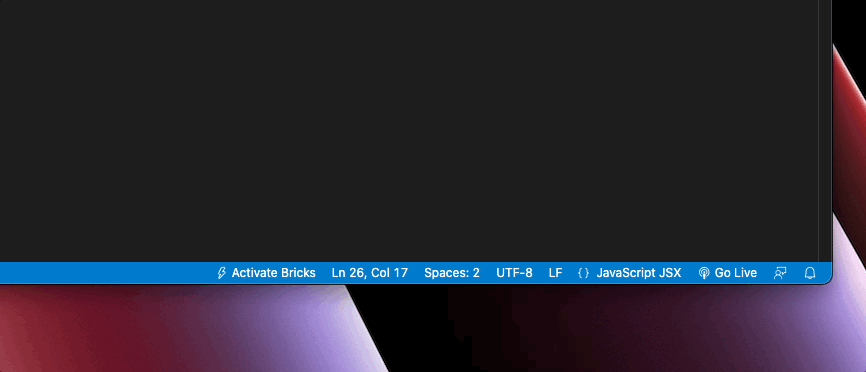
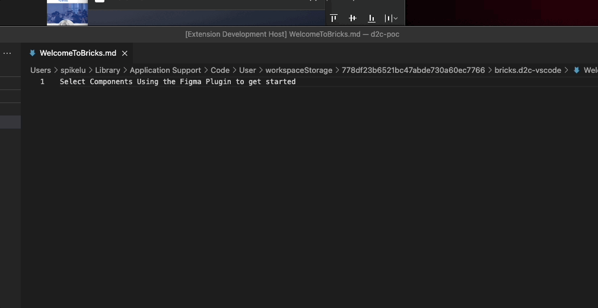

# Frequently Asked Questions
- [Frequently Asked Questions](#frequently-asked-questions)
  - ["Generate Code" button is greyed out](#generate-code-button-is-greyed-out)
  - [I closed the webview window. How can I reopen it?](#i-closed-the-webview-window-how-can-i-reopen-it)
  - [Preview within VSCode plugin is not working](#preview-within-vscode-plugin-is-not-working)
  - [Figma plugin is stuck on the loading screen](#figma-plugin-is-stuck-on-the-loading-screen)
  - [Code is not split into different components](#code-is-not-split-into-different-components)
  - [Images files cannot be opened within VSCode plugin](#images-files-cannot-be-opened-within-vscode-plugin)
  - [Generated components are very different from the design](#generated-components-are-very-different-from-the-design)

## "Generate Code" button is greyed out
- Install the [VSCode plugin](#https://marketplace.visualstudio.com/items?itemName=Bricks.d2c-vscode)
- Activate the plugin as shown down below

## I closed the webview window. How can I reopen it?
- You would have to regenerate the component. We are adding a new feature that would allow developers to reopen the webview pannel.

## Preview within VSCode plugin is not working
- Install the latest version of [Node.js](https://nodejs.org/en)
- After installation, open up the VSCode command `shift + command + p` 
- Find the command `Developer: Reload Window` to restart the VSCode plugin
- Reactivate the VSCode plugin and start generating code to see whehter the preview works as expected

## Figma plugin is stuck on the loading screen
- You can select any component within Figma to get unstuck and go back to the home page.

## Code is not split into different components
- We are working on this.

## Images files cannot be opened within VSCode plugin
- We are working on this.

## Generated components are very different from the design
- Let us know the use case through [Slack](#https://join.slack.com/t/brickscommunity/shared_invite/zt-1pb2hy3h2-9rDYWMZdHKxHblzUG0CpTQ) or [Github issues](#https://github.com/bricks-cloud/bricks/issues). We will fix the problem asap.